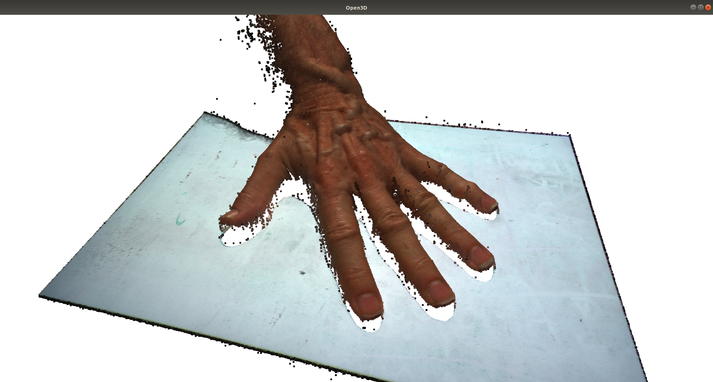

# Open3D-Test

### Summary
First [Open3D](http://www.open3d.org) test program. Imports a point cloud captured from the Ajile DepthScan which was exported in PCD format, then tries out a number of the features which are described in the [Open3D documentation and tutorials](http://www.open3d.org/docs/release/tutorial/Basic/index.html).

### Prerequisities
This example assumes that you have already installed Open3D. If you have not, header over the the [Open3D tutorials page](http://www.open3d.org/docs/release/tutorial/Basic/index.html), the installation is covered [here](http://www.open3d.org/docs/release/tutorial/Basic/python_interface.html#Install-open3d-Python-package). We actually installed from source since we plan to incorporate some of our own features into Open3D, but installing with pip will be much easier if you don't need to see the C++ source code. The command to install open3d will then be:

```
pip3 install open3d
# or
pip install open3d
# or
python3 -m pip install open3d
```
depending on your environment.

Before running this example, you should be able to import the open3d library from Python without problems, i.e.:
```python
import open3d as o3d
```
Next, if you don't have any sample point cloud images to work with, you can download some of ours from the [Ajile 3D-Data repository](https://github.com/Ajile3D/3D-Data). We used the hand.pcd file for our initial tests.

### Running the Example
With Open3D installed, and a sample point cloud (from the [Ajile 3D-Data repository](https://github.com/Ajile3D/3D-Data)), you should be able to run the open3d-test.py example with the following command:

```
python open3d-test.py ../../3D-Data/point_clouds/hand.pcd
```
Where hand.pcd will be the path to any .pcd file of your choosing.

### Expected Results

The open3d-test.py example runs through a number of features that are described in the [Open3D tutorials](http://www.open3d.org/docs/release/tutorial/Basic/index.html). Since it is nice to try do something somewhat productive while learning a new tool, the underlying goal while putting together this simple test program was to create a clean surface mesh from our captured point clouds.

As the example runs, a visualization window will pop up and show the progress of the 3D data so far. Below are screenshots showing what to expect at each step.




