# Surfacing-Test

### Summary
This is our first [Open3D](http://www.open3d.org) example program which creates a 3D mesh from a point cloud. It imports a point cloud which was captured from the [Ajile DepthScan](https://ajile.ca/depthscan3d/) which was exported to PCD format, then tries out a number of the features which are described in the [Open3D documentation and tutorials](http://www.open3d.org/docs/release/tutorial/Basic/index.html).

### Prerequisities
This example assumes that you have already installed Open3D. If you have not, head over the the [Open3D tutorials page](http://www.open3d.org/docs/release/tutorial/Basic/index.html), the installation is covered [here](http://www.open3d.org/docs/release/tutorial/Basic/python_interface.html#Install-open3d-Python-package). We actually installed from source since we plan to incorporate some of our own features into Open3D, but installing with pip will be much easier if you don't need to see the C++ source code. The command to install open3d will then be:

```
pip3 install open3d
# or
pip install open3d
# or
python3 -m pip install open3d
```
depending on your environment.

Before running this example, you should be able to import the open3d library from Python without problems, i.e.:
```python
import open3d as o3d
```
Next, if you don't have any sample point cloud images to work with, you can download some of ours from the [Ajile 3D-Data repository](https://github.com/Ajile3D/3D-Data). We used the hand.pcd file for our initial tests. This point cloud was captured with the [Ajile DepthScan](https://ajile.ca/depthscan3d/) at a distance of around 50 cm, in high resolution mode with a total capture time of around 400 ms. 

### Running the Example
With Open3D installed, and a sample point cloud (from the [Ajile 3D-Data repository](https://github.com/Ajile3D/3D-Data)), you should be able to run the open3d-test.py example with the following command:

```
python open3d-test.py ../../3D-Data/point_clouds/hand.pcd
```
Where hand.pcd will be the path to any .pcd file of your choosing.

### Expected Results

The open3d-test.py example runs through a number of features that are described in the [Open3D tutorials](http://www.open3d.org/docs/release/tutorial/Basic/index.html). Since it is nice to try do something somewhat productive while learning a new tool, the underlying goal while putting together this simple test program was to create a clean surface mesh from our captured point clouds.

As the example runs, a visualization window will pop up and show the progress of the 3D data so far. Below are screenshots showing what to expect at each step.

1. Open PCD File
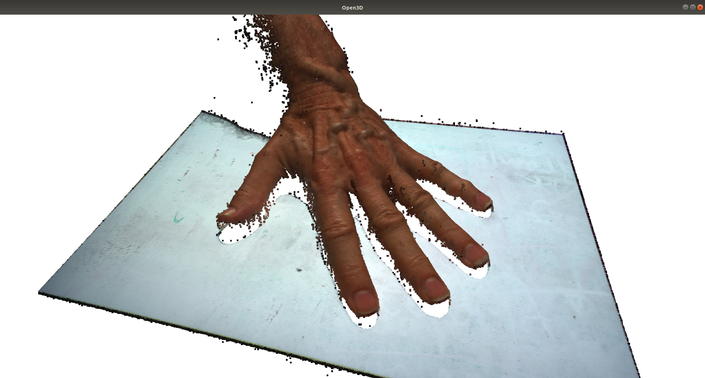

1. Downsampled point cloud (Voxel size of 1.0 mm)
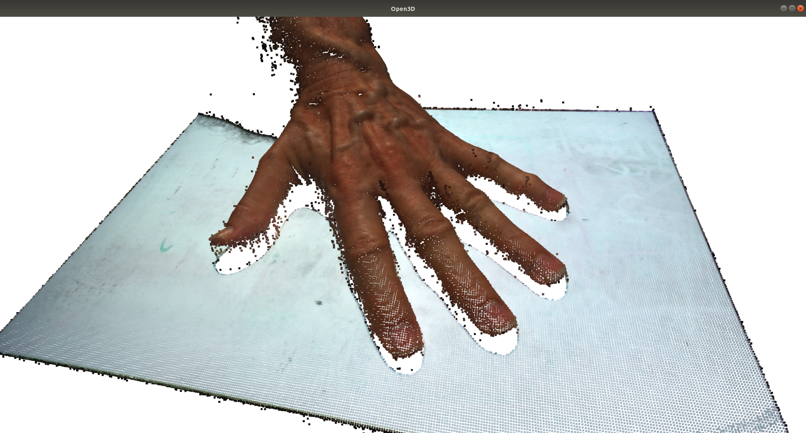

1. Fit a plane to background points
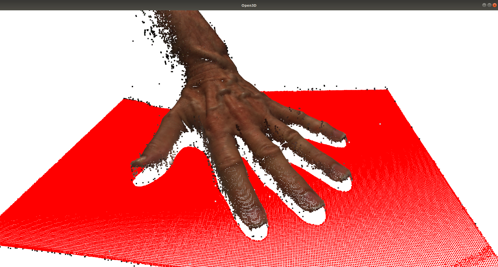

1. Remove all points on or below the fit plane (remove all background points)
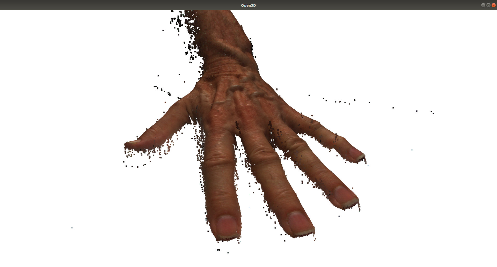

1. Run statistical outlier removal filter to get rid of noise around edges.
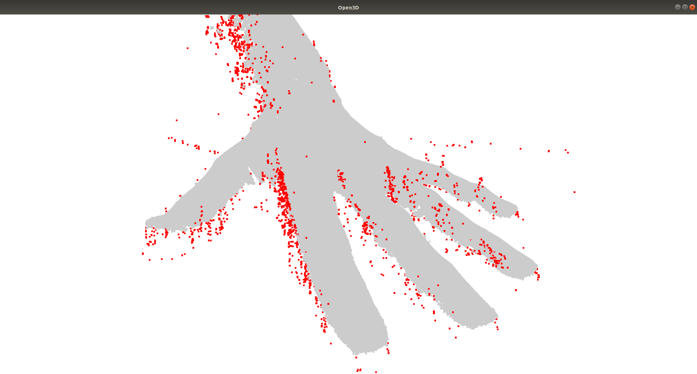

1. Point cloud with outlier points removed
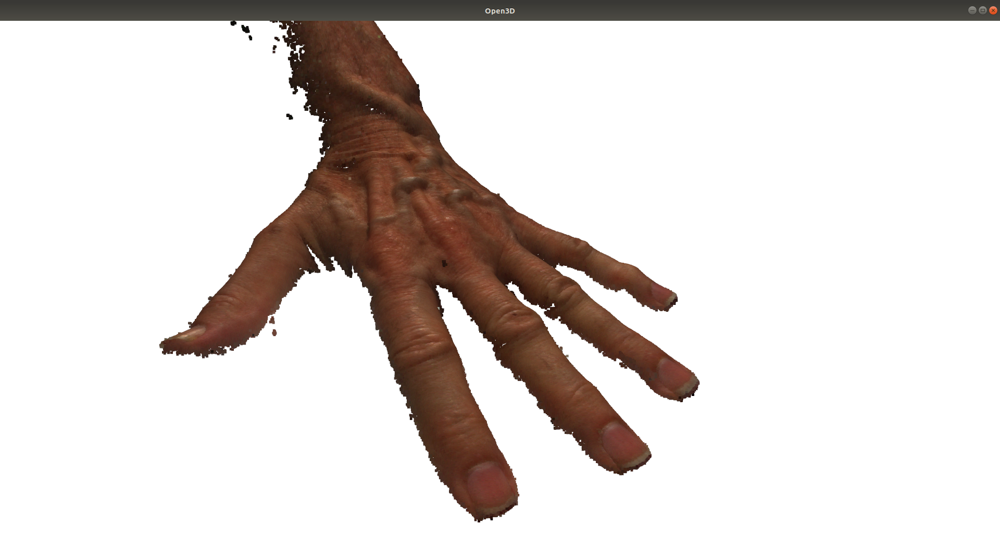

1. Bounding box and oriented bounding box (not useful for surfacing, just for visualization)
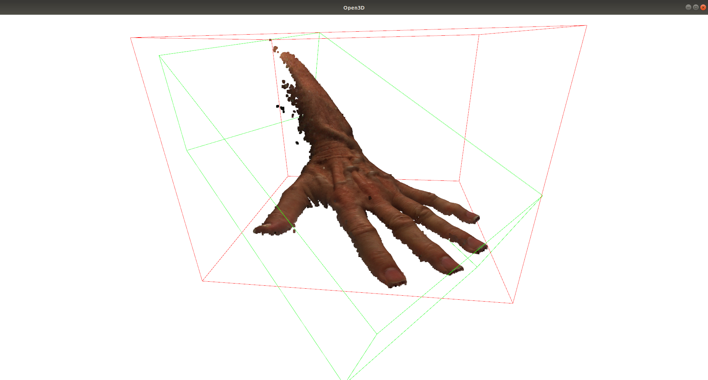

1. Convex hull of point cloud (not used for surfacing, but a nice filter for bounding the points)
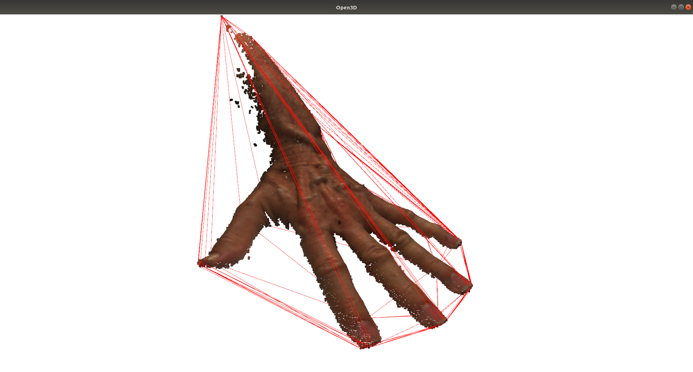

1. 3D segmentation with [DBSCAN clustering](http://www.open3d.org/docs/release/tutorial/Basic/pointcloud.html#DBSCAN-clustering), to further elimate disconnected points before surface meshing. There were 17 clusters found, with the blue one being by far the largest.
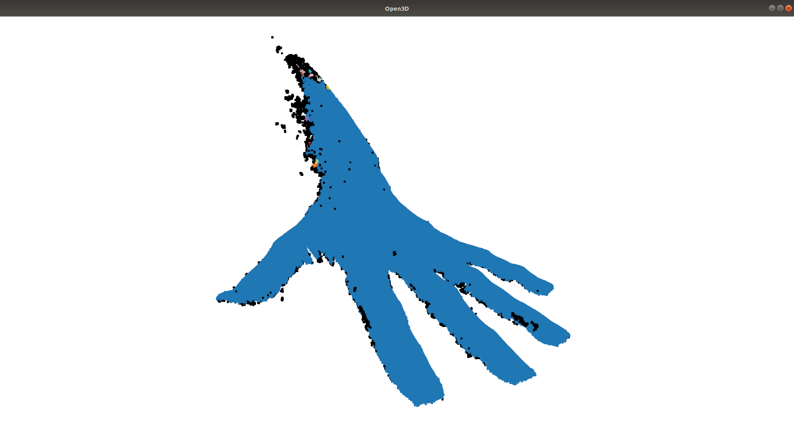

1. The largest segmented region. All smaller segments have been discarded.
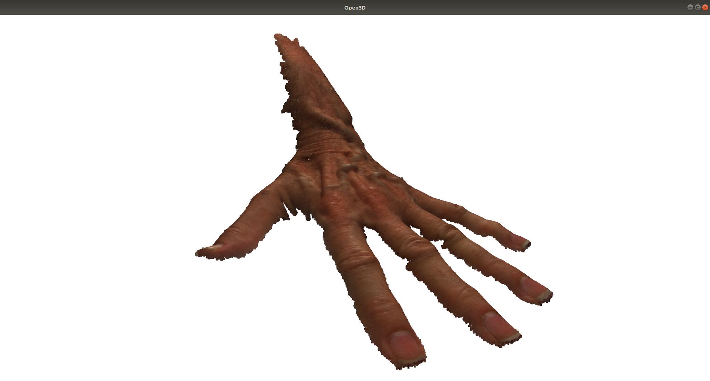

1. Surface mesh from point cloud using [Alpha Shapes](http://www.open3d.org/docs/release/tutorial/Advanced/surface_reconstruction.html#Alpha-shapes)
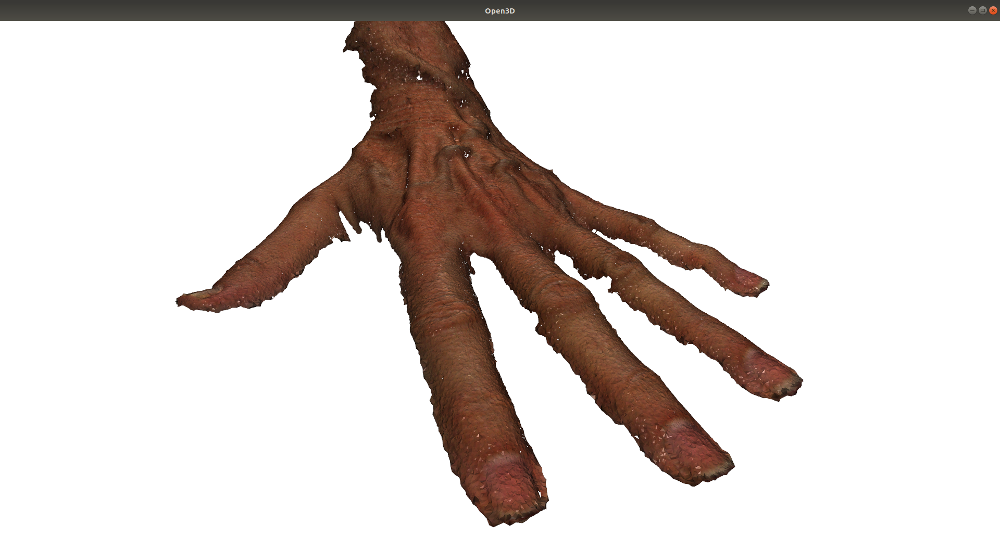
Zooming in on the Alpha Shapes surfaces and looking at the wireframe model, it looks a bit noisy though:
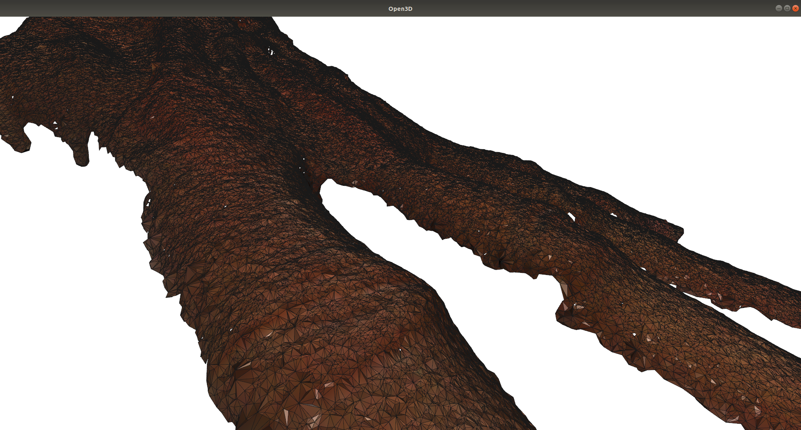

1. The remaining surfacing techniques need surface normals to proceed. Normal estimation of point cloud (note that many normals are behind the point cloud since the direction is reversed.)
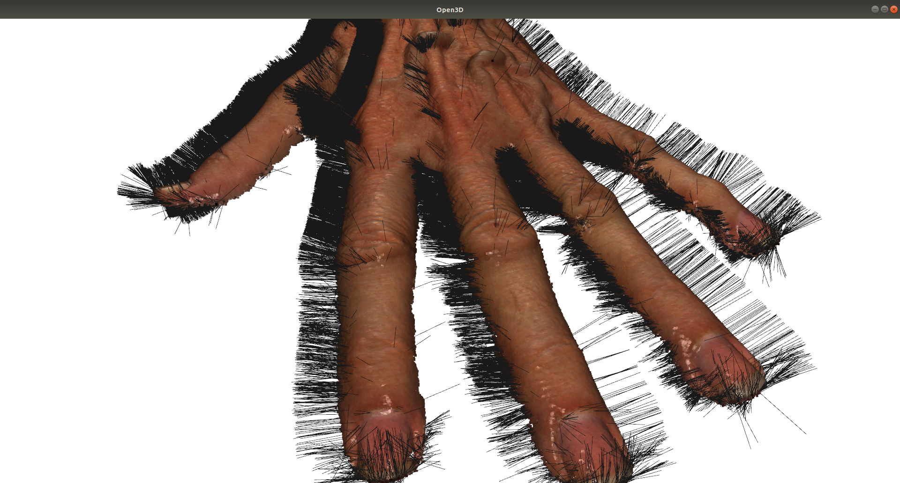

1. Surface mesh created from point cloud using [Ball Pivoting](http://www.open3d.org/docs/release/tutorial/Advanced/surface_reconstruction.html#Ball-pivoting)
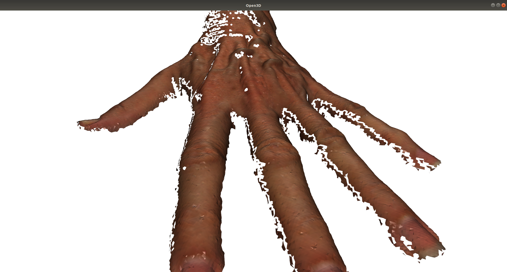
Works better than Alpha Shapes, but the triangles are a bit too sparse, resulting in too many holes in the mesh.

1. Surface mesh from point cloud using [Poisson surface reconstruction](http://www.open3d.org/docs/release/tutorial/Advanced/surface_reconstruction.html#Poisson-surface-reconstruction). 
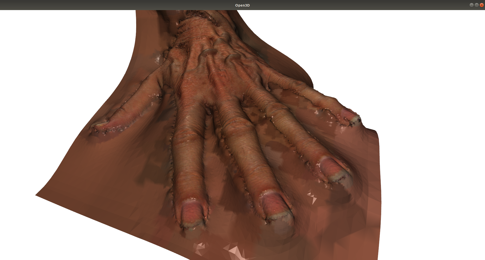
The mesh looks great, however obviously the webbing between fingers is an artifact of the Poisson reconstruction algorithm!

1. As described on the [Poisson surface reconstruction tutorial](http://www.open3d.org/docs/release/tutorial/Advanced/surface_reconstruction.html#Poisson-surface-reconstruction), we will use the density of points around each vertex to know if it is a real triangle if there are sufficient supporting points for it. Heat map (plasma color table) of point densities, brighter color means higher density.
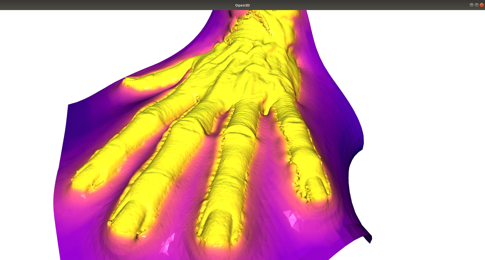

1. Surface mesh from Poisson reconstruction, after low density vertices have been removed. Zoomed in wire mesh view.
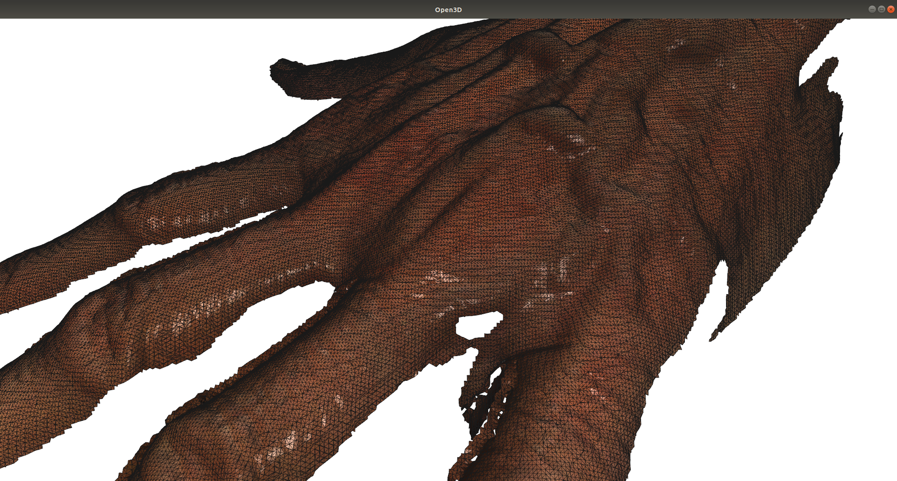

### Conclusions

Overall we were very impressed with using Open3D for some basic 3D analysis. It is a very well designed library, which makes it very easy to use. Its documenation and the tutorials are also quite good. We were able to import our point clouds and get to work immediately, and the entire excercise only took an afternoon, which included installing the tools, working through the tutorials, writing the code, and running the tests. Having worked with other libraries like [Point Cloud Library](https://pointclouds.org/) in the past and making very little progress, I was amazed at how quickly we were able to get good results. In addition to the Open3D API being very well designed, the implementation is definitely highly optimized. Even throwing our 4 million point color point clouds at it, Open3D had no trouble in efficiently handling the data and quickly giving the results, usually in less than a second without even downsampling. Finally it seems that there is a good open source 3D library out there, similar to OpenCV but optimized for 3D imaging.
